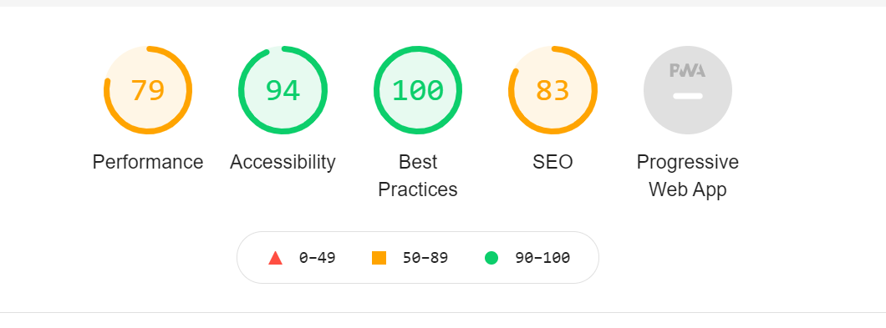

# Frontend Assignment

[](https://www.deepcode.ai/app/gh/adi-g15/FrAst/_/dashboard?utm_content=gh%2Fadi-g15%2FFrAst)
[](https://www.codefactor.io/repository/github/adi-g15/frast)


### Task

Build a general dynamic table filter component that generates a filter query
object in a specific format and consume it to filter a table with data fetched from firebase (used firebase as source)

> FrontEnd - React
>
> Database - FireStore

### Scripts

> Names will imply there task generally

<table>
    <tbody>
        <tr>
            <td><code>react-scripts start</code></td>
            <td>Deploy development version available at localhost:3000</td>
        </tr>
        <tr>
            <td><code>react-scripts build</code></td>
            <td>Build a production version that can be deployed to any static website hosting</td>
        </tr>
    </tbody>
</table>

### Directory Structure

```
.
├───.github/workflows
├───public
└───src
    ├───components (src for react components)
    ├───config
    ├───constants (operation types)
    ├───styles (css styles)
    └───utils (utility functions)
```

### Pages
Index page (`/`) - It's source code is in `/src/App.jsx`

### Brief Implementation Details -
* `<App />` component is a div containing `<Filters />` and `<DataTable />`, and these two child components are connected to each other, using state variables in the parent, ie. `<App />`

* `<Filters />` handles the fetching of supported operations, as well as managing the filters array, according to chosen filters (where each filter row is a `<FilterField />` component)
* `<DataTable />` accesses the filters through App component

* Another key thing is, that logical operators like `==`, `>=`, `<=` can only be used once, that's a restriction imposed in the code itself, more can be seen in the file `src/components/filters.jsx` and the filtering of these operations from future usage is being done in `utils/difference.js`

 > Suggested Order Exploring the codebase - index.js, App.js, Filters.js, FilterField, DataTable, then for more detail, difference.js

## Todo
  * 👍 Styling
  * _\[DROPPED\]_ Paging
  * 👍 DB connectivity

## LightHouse report



@ Aditya Gupta 2021
